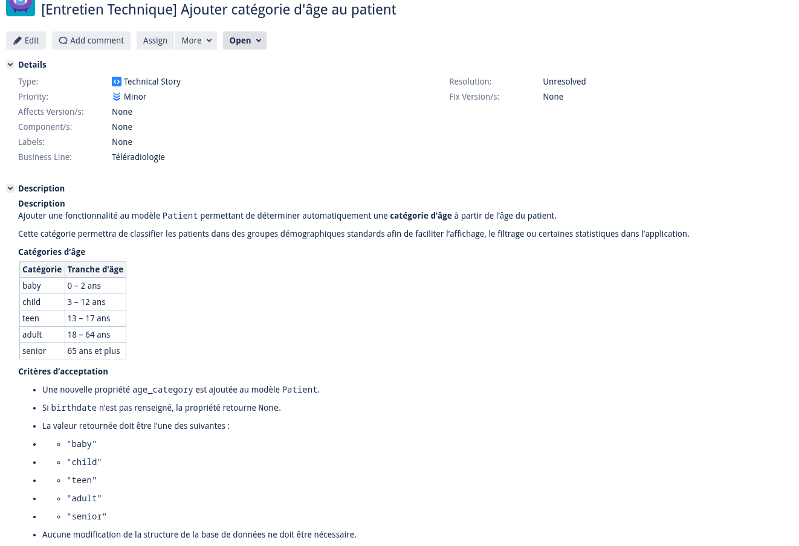

# Test technique NestJS — Domaine de la santé

## Objectif

Faire passer tous les tests unitaires **sans modifier les fichiers `*.spec.ts`**.

Les tests décrivent le comportement attendu. Votre rôle est d'implémenter le code correspondant.
**Durée estimée : 1 heure**

---

## Mise en place

```bash
npm install
npm test
```

Vous devriez voir tous les tests échouer. Votre objectif est de les faire tous passer.

Pour lancer les tests en mode watch :

```bash
npm run test:watch
```

---

## Fichiers à compléter

### `src/patient/patient.entity.ts`

La classe `Patient` est définie avec ses propriétés. 
---

### `src/patient/patient.service.ts`

Le service `PatientService` gère une liste interne de patients.


## Règles

- **Ne pas modifier** les fichiers `*.spec.ts`
- **Ne pas modifier** les énumérations `Wound` ni la constante `CANT_WALK_WOUNDS` dans `patient.entity.ts`
- Vous pouvez ajouter des méthodes privées si nécessaire


## Bonus

Développer la fonctionnalité suivante :


